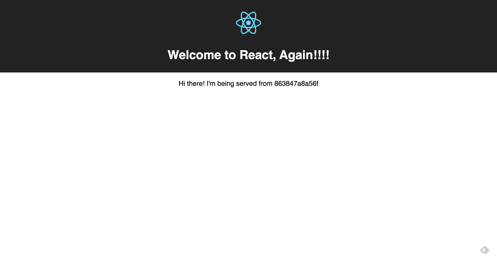

## Devops

MERN Boilerplate

## Available Scripts


In the project directory, you can run:

```docker-compose down -v && docker-compose up --build```


- Runs the app client in the development mode.<br>
Open [http://localhost:3000](http://localhost:3000) to view it in the browser.

- Runs the app api.<br>
Open [http://localhost:3001](http://localhost:3001) to view it in the browser.

The page will reload if you make edits.<br>
You will also see any lint errors in the console.

## Screenshot


