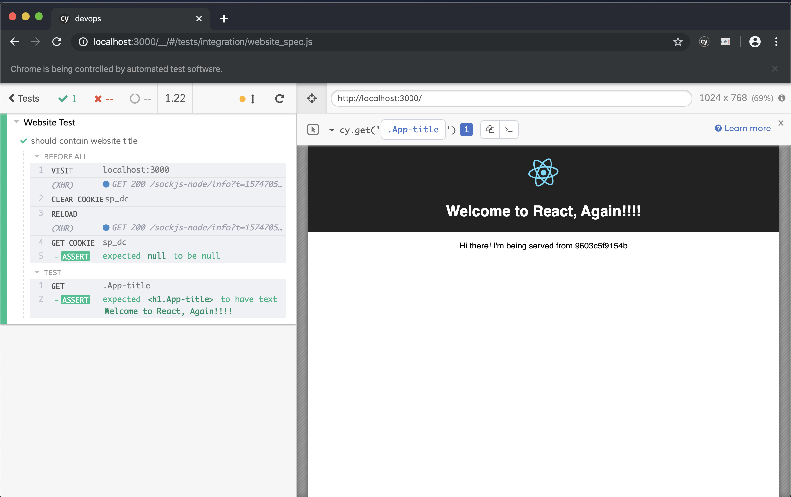

[](https://circleci.com/gh/anthonykaluuma/devops/tree/master)
## Devops  :tada:

#### Tech stack 
- [Mongo](https://mongodb.github.io/node-mongodb-native/)
- [Expres](https://expressjs.com/)
- [React](https://reactjs.org/)
- [Node](https://nodejs.org/en/)
- [Cypress](https://www.cypress.io/)

#### CI/CD

- [CircleCI](https://circleci.com/gh/anthonykaluuma/devops)

## Available Scripts

### Local Virtual Machine

In the project directory, you can run:

```docker-compose down -v && docker-compose up --build```


- Runs the app client in the development mode.<br>
Open [http://localhost:3000](http://localhost:3000) to view it in the browser.

- Runs the app api.<br>
Open [http://localhost:3001](http://localhost:3001) to view it in the browser.

The page will reload if you make edits.<br>
You will also see any lint errors in the console.

### Local Installation 

```npm install```

### Running locally 

```npm start```

- Runs the app client in the development mode.<br>
Open [http://localhost:3000](http://localhost:3000) to view it in the browser.

- Runs the app api.<br>
Open [http://localhost:3001](http://localhost:3001) to view it in the browser.

The page will reload if you make edits.<br>
You will also see any lint errors in the console.


## Tests

In the project directory, you can run:

```npm test```

This will execute the cypress test suite 




## Screenshot


